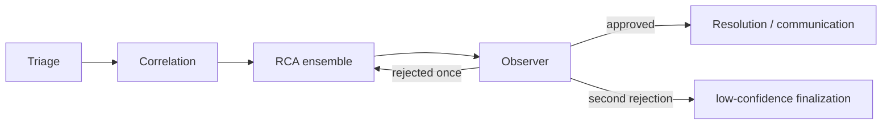

# AI system and LangGraph

This is an AI-assisted investigation system, not a free-form autonomous chatbot. The implementation limits what a model can request, how long it can continue, what it can claim, and whether it can affect infrastructure.

## Investigation graph

The compiled LangGraph uses supervisor routing around these implemented stages:

The graph bounds work: supervisor revisions, graph recursion, Correlation rounds/calls, Correlation invocations, RCA ensemble passes, and a total incident token budget all have settings. A rejected Observer verdict may send the graph back to RCA only once; injection-flagged evidence is excluded on revision.

## Agents

| Agent | Actual responsibility |
| --- | --- |
| Triage | Applies a deterministic severity floor, asks an LLM for assessment, clamps model output below the floor, and degrades to rules on provider failure. |
| Correlation | Uses a structured LLM plan to select from an allowlisted read-only tool catalog, dispatches bounded calls, then synthesizes evidence. Falls back to a small deterministic sweep if planning is unavailable. |
| RCA | Retrieves service-filtered runbook chunks and relevant approved memory, performs multiple reasoning passes, measures agreement, and emits a hypothesis/claims. |
| Observer | Runs deterministic citation/evidence validation first; an LLM semantic critique can veto but never rescue an invalid result. |
| Resolution | Selects only from a catalog then turns the choice into a controlled proposal/execution path. Deterministic gates make the final safety decision. |
| Communication | Produces operational updates; worker-side delivery can use the Slack MCP integration. |
| Memory | Creates a resolved-incident summary then waits for human approval before it becomes recallable. |

## Prompts, structured output, and providers

Prompts live in the versioned prompt library. LLM call sites use the registry plus input/output guardrails and persist a `prompt_ref` in structured step output. Most structured calls use Pydantic schemas and provider-side schema enforcement/repair; RCA intentionally uses its own pass parsing/retry path instead.

The provider factory selects `openrouter` or `gemini`. Both support configured key pools/fallback models; provider calls return text, model attribution, token count, cost when available, latency, prompt/completion token counts, prompt reference, and repair attempts. Provider exhaustion degrades defined agents where a fallback exists rather than inventing results.

What “structured output” means here

For a structured call, Aegis asks the provider for data matching a Pydantic schema rather than a paragraph that later code has to guess how to parse. For example, Correlation returns a bounded tool plan and RCA returns a hypothesis shape. Invalid output can receive a limited repair attempt. The application persists model and repair metadata so a later review can identify which prompt/model produced a result.

## Evidence discipline

Evidence goes through `EvidenceStore`: content is redacted, bounded, and rendered as explicit evidence data for prompts. Correlation tools are an allowlist, not a dynamic server inventory; a model cannot invoke write-capable Kubernetes tools merely by naming them. Evidence gaps are also redacted, tag-defanged, newline-collapsed, and length-bounded before prompts/logs.

The current read-only catalog includes Kubernetes pod/deployment/events/log views, Prometheus instant/range queries and alerts, and GitHub recent commits/commit diffs. A change-related claim requires change evidence.

## Honest limitations

The repository’s own operational status notes that end-to-end LLM output quality remains constrained by free-tier quotas; retrieval has no relevance floor by default; and RAGAS metrics have not been run. Treat LLM-generated explanation/communication as assistance, not an independent safety control. The deterministic Observer and remediation gates are the controls that hold authority.

Related: [Data, RAG, and memory](./data-and-rag.mdx), [Security and safety](./security-and-safety.mdx), [Evaluation](./evaluation.mdx).

## Extension rule of thumb

If you add a model-facing capability, add the deterministic boundary with it: a schema, an allowlist or catalog where the model selects a capability, input/output guarding, a bound on retries/work, and a test for the non-LLM behavior. See [Contributing](./contributing.mdx).
