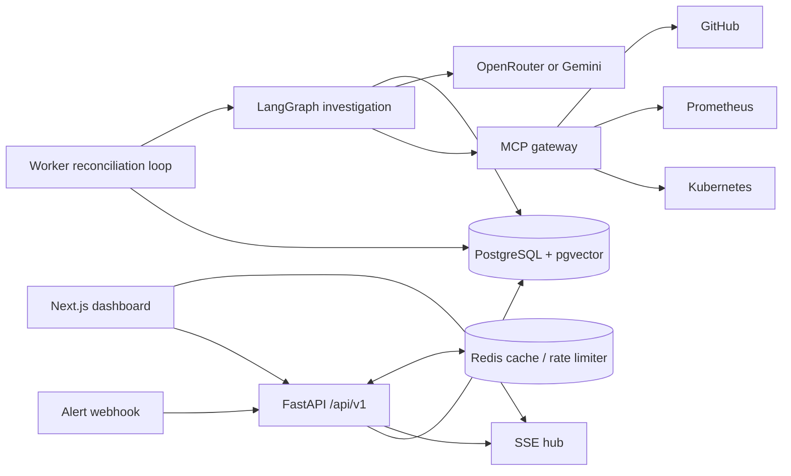
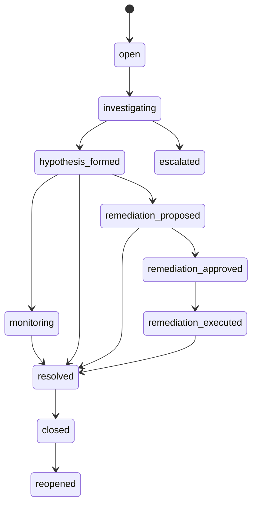
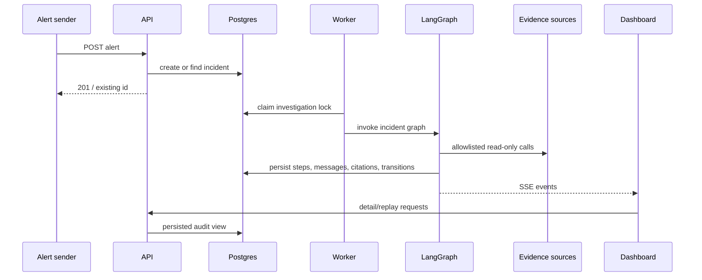
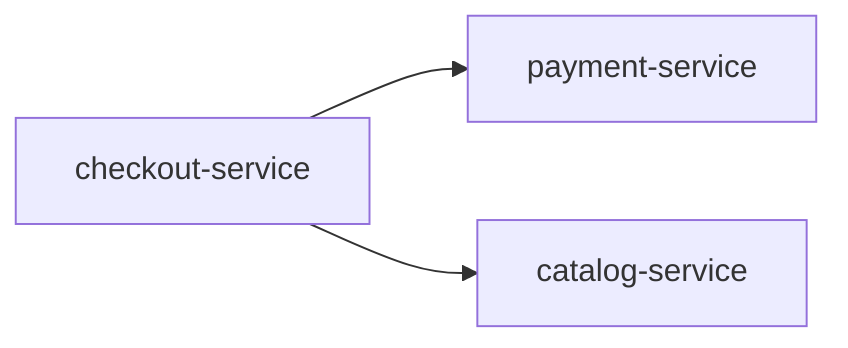

# Architecture

This page explains the system from the outside in. Start with the system view; use [AI system](./ai-system.mdx) for the reasoning details and [Data, RAG, and memory](./data-and-rag.mdx) for the stored data.

## System view

PostgreSQL is the durable source of truth. Redis is deliberately non-authoritative: cache failures are tolerated, and the rate limiter fails open if Redis is unavailable. The API publishes process-local SSE events after durable work; SSE is not a database change feed.

## Incident lifecycle

The database state machine is the authority for legal transitions, and every transition records actor type/id. The worker also records an investigation lock so abandoned `investigating` incidents can be reclaimed after a worker failure.

## Request and investigation flow

## Why the boundaries matter

The API is deliberately thin: it accepts and serves requests but does not investigate an alert or make infrastructure changes in the request. That separation makes retries safer and keeps a slow model/tool call from holding a browser request open. The worker is responsible for claiming and progressing durable work.

Similarly, the graph owns the order in which agents run. An agent cannot call a neighboring agent directly, which makes graph routing, retry bounds, persistence, and audit behavior visible in one place.

## A concrete example

For a `payment-service` crash-loop alert, the worker can: classify the alert; ask Correlation to inspect pods, events, metrics, and relevant changes; run multiple RCA passes with the gathered evidence and service-filtered runbooks; have Observer reject unsupported claims; and finally create a remediation proposal if a validated hypothesis maps to the action catalog. Each visible dashboard step comes from rows persisted during those stages.

## Component boundaries

- **API:** authentication, ingestion, read/query endpoints, approvals, safety control endpoints, SSE.
- **Worker:** claims work, executes/reconciles the graph and approved action lifecycle; protects against concurrent workers with DB locking.
- **Graph:** owns routing. Agents do not invoke each other directly.
- **Agents:** pure or narrowly-scoped reasoning cores; graph nodes isolate persistence/SSE effects.
- **MCP layer:** capability boundary for external systems. Agents use a gateway and no direct infrastructure credentials.
- **Frontend:** renders persisted API data and event streams; role controls improve usability only and are rechecked server-side.

## Deployment topology

The checked-in infrastructure deploys the simulated Meridian services to `kind`, configures kube-prometheus-stack, and provides separate read-only and writer Kubernetes RBAC manifests. The read role permits read/list/watch for pods, logs, events, services/endpoints, deployments and replicasets. Writer permissions are separately scoped to deleting pods and patching/updating deployment scale. See [Operations](./operations.mdx).

## Repository orientation

| Directory | Read it when you need to… |
| --- | --- |
| `backend/api` | Understand the HTTP boundary, auth, SSE, and route contracts. |
| `backend/worker` | Understand claim/recovery and asynchronous investigation execution. |
| `backend/orchestrator` | Follow graph nodes and supervisor routing. |
| `backend/agents` | Inspect individual reasoning and safety responsibilities. |
| `backend/mcp_servers` | See external-system clients, contracts, and tool boundaries. |
| `backend/db` | Understand models, lifecycle rules, and migrations. |
| `frontend` | Understand dashboard pages and the typed browser API client. |
| `infra` | Operate the local kind/Meridian/Prometheus environment. |

Next: [AI system and LangGraph](./ai-system.mdx) · [Security and safety](./security-and-safety.mdx).

## Design choices in plain language

### Durable state before live presentation

The dashboard is a view of persisted work, not a second source of truth. A graph node first writes its agent step, message, citations, and event-related state to Postgres. It then publishes an SSE notification. If the browser disconnects, it can retrieve the complete detail or replay endpoint later. This prevents a missed real-time message from becoming a missing investigation record.

### A worker, not a long HTTP request

An alert API request is intentionally short: it validates and stores the alert. Model calls and infrastructure calls can be slow, retry, or degrade. Performing those inside an HTTP request would make client retries hard to distinguish from new incidents and would make a browser timeout look like an investigation failure. The worker gives each incident an explicit owner lock and can recover abandoned work.

### Multiple narrow controls instead of one “AI safety” switch

No single prompt is treated as a protection boundary. Tool allowlists control evidence capability, roles control human authority, state transitions control timing, and the remediation engine checks kill switch, expiry, approval/tier, Observer result, blast radius, circuit breaker, and lease. A defect or poor model result in one layer does not automatically bypass the rest.

## Meridian topology

Meridian has three statically declared services. The topology is used twice: Correlation uses it to identify likely upstream/downstream evidence, and Resolution uses it to estimate a remediation’s blast radius.

For example, a failure in `payment-service` has `checkout-service` as a dependent. A Tier-1 action whose dependent count exceeds `MAX_BLAST_RADIUS_DEPENDENTS` is refused and must be handled by a human.
