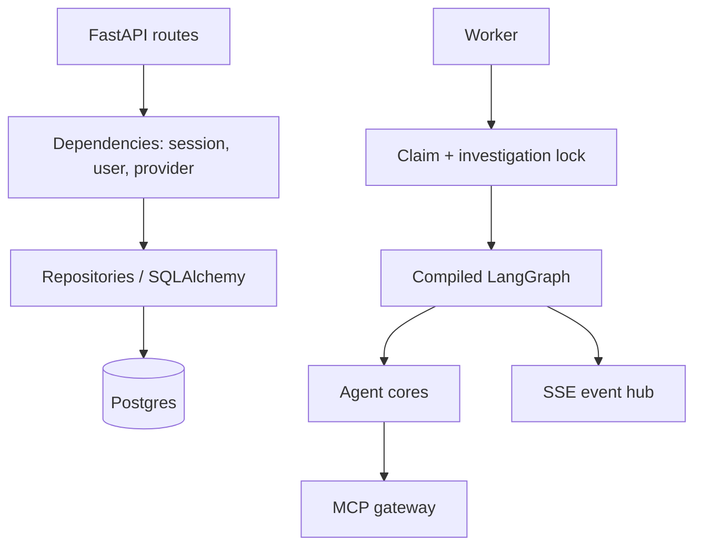

# Backend guide

The backend is an asynchronous Python application built around FastAPI, SQLAlchemy async sessions, a worker process, LangGraph orchestration, and narrowly scoped MCP integrations. Its job is not simply to call a model: it makes each investigation durable, bounded, explainable, and reviewable.

## Backend at a glance



## Application lifecycle

`api.main` creates the FastAPI application. Startup configures structured logging and starts the event hub. Shutdown stops the hub and closes the Redis pool. Router modules are mounted under `/api/v1`; health and metrics are deliberately available both at versioned and unversioned paths.

The application applies two HTTP middlewares:

1. **Rate limiting** builds a bucket from client address, method, and route template. It intentionally normalizes parameterized paths, so changing an incident id cannot create a fresh rate-limit budget. SSE and health are exempt because they are long-lived/probe behavior rather than normal request traffic.
2. **Webhook guarding** verifies `X-Aegis-Webhook-Token` with a constant-time comparison when `INGEST_WEBHOOK_TOKEN` is configured.

## Route responsibilities

| Route group | What it owns | What it does not own |
| --- | --- | --- |
| `auth` | Firebase exchange, Aegis cookies, refresh rotation, logout, current user | Frontend Firebase popup flow |
| `incidents` | Alert persistence, list/detail/replay, streams, human resolve | Running the graph in the request |
| `actions` | Approval records, breaker/kill-switch reads and changes | Direct Kubernetes execution |
| `runbooks` | Authenticated RAG query endpoint | Runbook ingestion UI |
| `memory` | Pending memory list and human approval | Automatic unreviewed memory write-back |

## Dependency injection and authorization

Route dependencies provide an `AsyncSession`, the current user, required role checks, and the configured LLM provider where a route needs one. Privileged routes call `require_role` on the server; a disabled frontend button has no security authority.

The usual route pattern is:

```python
@router.post("/{incident_id}/resolve")
async def resolve_incident(
    incident_id: uuid.UUID,
    session: AsyncSession = Depends(get_session),
    user: User = Depends(require_role(UserRole.on_call_engineer, UserRole.admin)),
):
    ...
```

This example illustrates the actual design, not a generic recommendation: the route has a typed identifier, transactional session, and role boundary before it can transition state.

## Worker behavior

The worker is the long-running executor for incident work. It claims eligible incidents using the persisted investigation lock, which distinguishes “currently owned by a worker” from merely “in the `investigating` state.” A reconciliation sweep can reclaim work stranded by a crash. This lets multiple worker processes contend safely without treating an in-memory queue as authoritative.

The worker invokes the graph with the incident’s durable fields, commits outcomes at defined points, and handles remediation only through the resolution engine. A route that approves a proposal never executes infrastructure work inline.

> [!NOTE]
> The exact event notification mechanism wakes workers promptly, but Postgres state remains the recovery source. A missed notification must not make a stored incident disappear.

## Error and response behavior

Expected product errors use Aegis error responses with a code/message/status. Examples include `not_found`, `invalid_state`, `proposal_expired`, `tier3_manual_only`, and `forbidden`. Input constraints come from Pydantic/FastAPI and return 422. The worker and agent paths record degradation/gaps rather than passing untrusted raw upstream failures into prompts.

## Persistence transaction pattern

Graph node persistence is centralized: an agent step, human-readable message, citations, and an SSE event are created in one defined side-effect helper. The event tells a browser to refresh/live-render; the data remains in Postgres. This design is why replay works after the process and external tools are gone.

For database concepts and tables, see [Database guide](./database.mdx). For the live browser contract, see [Frontend guide](./frontend.mdx).

## Where to begin debugging

| Symptom | Start here |
| --- | --- |
| HTTP 401/403 | Auth route, cookie settings, Firebase verifier, role allowlists. |
| Alert exists but no graph steps | Worker process, claim lock, DB health, worker logs. |
| Timeline event missing | Incident detail/replay first; then SSE connection/event hub. |
| Action approved but not executed | Remediation status, gate refusal/audit record, worker availability. |
| 429 unexpectedly | Route-template rate-limit bucket and Redis health/statistics. |

Next: [API reference](./api-reference.mdx) · [LangGraph guide](./langgraph.mdx) · [Observability guide](./observability.mdx).
