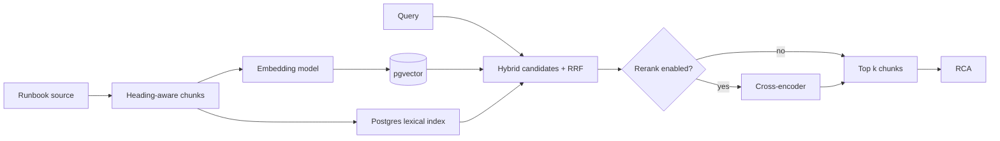

# Data, RAG, and memory

This page separates three ideas that are easy to conflate:

- **Incident records** are the durable operational history.
- **Runbooks** are retrieved reference material used during an investigation.
- **Memory summaries** are human-approved lessons from resolved incidents.

## Persistence model

PostgreSQL stores incidents, transitions, agent steps/messages/citations, users and refresh sessions, runbooks/chunks, remediation controls, memory summaries, and audit records. UUIDs are used for entity identifiers. The audit log is monthly range-partitioned with a composite `(id, created_at)` primary key; the model documents a 13-month rolling retention design.

| Data | Key implementation properties |
| --- | --- |
| `incidents` | Unique `(alert_source, external_alert_id)` makes webhook ingestion idempotent; retains alert kind/value and worker lock. |
| agent records | Per-step structured output, model/tokens/cost/latency and persisted redacted citations enable replay. |
| `remediation_actions` | Unique idempotency key, expiry, decision/result, blast radius, compensating action, shadow flag. |
| `resource_leases` | Partial unique DB index permits only one unreleased lease for a target. |
| refresh sessions | SHA-256 token hashes, token families, rotation and reuse-triggered family revocation. |
| runbooks/chunks | Original content plus heading path, tags, `tsvector`, and 384-dimensional vector by default. |
| memory summaries | Scoped/indexed by `(service_name, incident_type)` and unavailable to recall until approved. |

## Retrieval pipeline

Runbooks are chunked around Markdown heading structure with configured maximum, overlap, and minimum character sizes. The embedding default is `BAAI/bge-small-en-v1.5`, dimension 384, with a local model cache. Search combines semantic and lexical candidates using reciprocal-rank fusion, supports optional cross-encoder reranking, and can restrict by `service_tags`. The public endpoint exposes query, `k`, service, and rerank controls.

The graph searches with a service filter before RCA and renders each returned chunk with a citation. The default `RAG_MIN_SCORE` is `-11.0`, a calibrated cross-encoder logit floor. It applies only after reranking, because RRF scores are ranks rather than comparable relevance values. Disabling reranking therefore also bypasses this floor.

## Incident memory

When a human resolves an incident, Aegis drafts a summary from the final RCA output. It enters the pending queue, not long-term memory. An on-call engineer or admin may approve it and optionally edit only `symptom`, `root_cause`, `fix`, and `outcome`. During RCA, candidate memories are service/type scoped and relevance judged before inclusion.

> [!IMPORTANT]
> A draft is not recalled as knowledge. Only an approved summary can become evidence-like context for a later RCA pass.

## Cache behavior

Redis caches external evidence JSON with a TTL (30 seconds by default); it is never authoritative. Corrupt cache values are cache misses. Redis also provides fixed-window counters for normal API and ingestion rate limits, but unavailable Redis allows calls rather than stopping incident response.

## Reading a runbook search result

`GET /runbooks/search` returns chunk-level results rather than pretending an entire runbook was relevant. A result includes its runbook id/title, heading path, citation, a short content snippet, score, source, service tags, and match origin. This lets an operator open a result in context and lets RCA cite the relevant section rather than a vague document title. See the [API reference](./api-reference.mdx#runbooks-and-memory).
