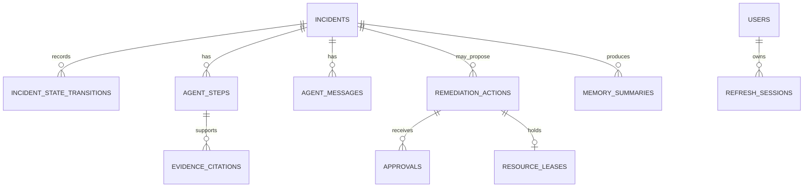

# Database guide

PostgreSQL is Aegis’s system of record. It holds the facts needed to resume an investigation, enforce a legal lifecycle, audit a decision, replay a past incident, and retrieve operational knowledge. Redis is useful but intentionally cannot replace any of those roles.

## Data model overview

## Incidents and state transitions

An incident is the correlation anchor. Its `alert_source` and `external_alert_id` have a database uniqueness constraint, so a webhook retry cannot create a duplicate row. It includes human-visible title/service/severity, the original optional alert kind/value, current state, timestamps, and a worker investigation lock/lock time.

The state machine is a code-level allowlist. A transition records `from_state`, `to_state`, actor type (`agent`, `human`, or `system`), actor id, and time. Routes and worker code must use the repository transition method rather than treating the state column as a free-form string.

### Why the lock is separate from state

`investigating` only means the lifecycle reached investigation. It cannot tell whether a worker is still alive. The lock fields answer the ownership question, letting a reconciliation process recover an incident after a worker crashes without weakening the state model.

## Agent history and replay

| Table | Stored detail | Operator value |
| --- | --- | --- |
| `agent_steps` | Summary, structured output, confidence, model, token/cost/latency, ensemble index | Explains one execution of an agent. |
| `agent_messages` | Reasoning/action/handoff content and metadata | Presents the agent’s narrative/timeline. |
| `evidence_citations` | Evidence type/reference/redacted snippet and Observer validation marker | Makes supporting material inspectable. |
| `audit_log` | Append-only actor/action/target/incident metadata | Supports security and control-plane audit. |

The replay API merges transitions, steps, and messages by timestamp and returns a numbered sequence. It does not rerun an LLM or query Kubernetes: a replay is historical truth about what Aegis recorded at the time.

## Remediation safety data

`remediation_actions` is intentionally more than a work queue. Each row stores a unique idempotency key, action tier/type/target, parameters, a non-null compensating action, reasoning, blast radius, status, proposal/expiry timestamps, optional approver/execution time, shadow indicator, and result.

The idempotency key uses incident/action/target identity. If the same graph work is retried, the engine can return the existing proposal instead of creating a second potentially conflicting row.

`resource_leases` has a partial unique index over target resource type/id where `released_at IS NULL`. That makes “only one active action per resource” a database property, not a best-effort process convention.

The global breaker is represented by `action_circuit_breaker_events`; approvals are their own rows; the durable kill switch is a keyed `system_flags` record. These survive API/worker restarts.

## Identity and session data

Users have unique email, optional Firebase identity/profile fields, role, and last-login information. Refresh-session rows contain a SHA-256 token hash rather than raw refresh token. A family id groups every rotation of one login; replaying a rotated token revokes the family to limit stolen-token reuse.

## Runbooks, chunks, and memory

Runbooks store original content/provenance/tags and embedding metadata. `runbook_chunks` store the heading-aware pieces that retrieval actually returns: chunk index/content/heading path/service tags, pgvector embedding, and lexical `tsvector` index.

Memory summaries reference the incident that produced them and store a service/type scope, symptom, cause, fix, outcome, and optional approver. The `(service_name, incident_type)` index reflects the retrieval boundary; a memory from a different service is not casually treated as precedent.

## Migrations and schema changes

Alembic migrations under `backend/db/migrations/versions` define schema evolution, including initial tables, refresh sessions, safety tables, Firebase identity, runbook chunks/index provenance, alert context, worker lock, and escalated state. When contributing a schema change, include a migration, model update, affected route/schema behavior, and test coverage. Do not edit an old migration that may already be applied in another environment.

## Operational implications

- Back up Postgres; it holds canonical incidents and audit history.
- Redis can be restarted without losing canonical records, though cache/rate-limit counters reset.
- The audit log is partitioned by month because it grows faster than business tables; database maintenance should account for its partition/retention design.
- Avoid writing raw secrets or unredacted evidence to JSON fields. The redaction pipeline exists before durable evidence/citation handling.

Related: [Data, RAG, and memory](./data-and-rag.mdx) · [Backend guide](./backend.mdx) · [Security and safety](./security-and-safety.mdx).
