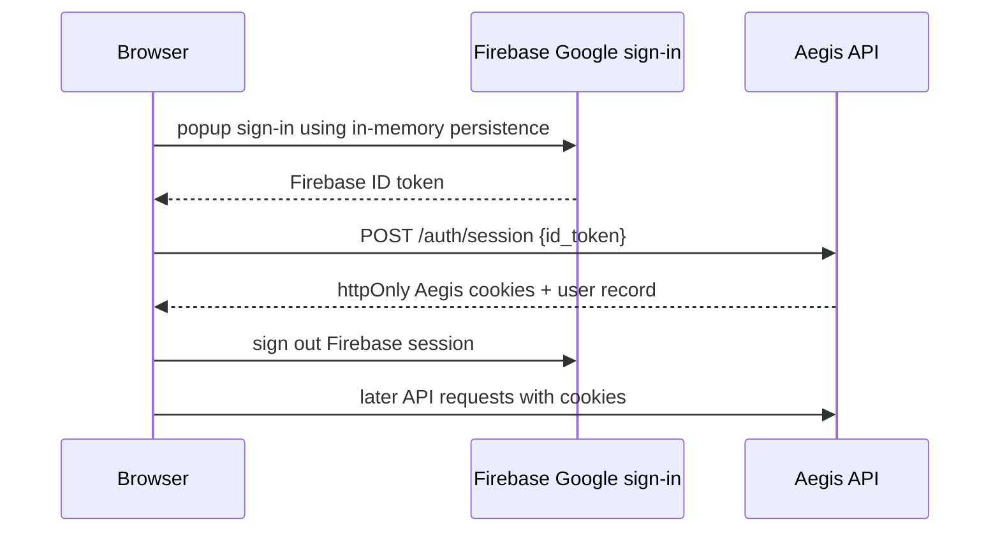

# Frontend guide

The frontend is a Next.js application that presents Aegis as an operator workspace. It does not make safety decisions and does not own session tokens. It renders API data, follows live SSE updates, and gives users understandable controls for their assigned role.

## Pages and user journeys

| Route | Purpose |
| --- | --- |
| `/` | Public product overview with a pipeline schematic rather than fabricated incident data. |
| `/login` | Google/Firebase sign-in and Aegis session exchange. |
| `/dashboard` | Incident list and live activity view. |
| `/incidents/[id]` | Detail timeline, agent output, evidence/citations, and resolution controls. |
| `/replay/[id]` | Ordered persisted history for a completed or historical investigation. |
| `/approvals` | Tier-2+ proposal review queue. |
| `/settings/kill-switch` | Read and change the durable autonomous-action switch according to role. |

The shared `AppShell` provides navigation and user context. Supporting components include the agent timeline, status badges, local time display, live indicator, theme toggle, and user badge.

## Authentication handoff

Firebase is used to prove the Google identity. The browser configures its Firebase SDK for in-memory persistence before login and signs out after exchange, so the Firebase bearer token is not deliberately retained in IndexedDB/local storage. The long-lived browser credential is Aegis’s own httpOnly cookie, which JavaScript cannot read.

## Typed API contract

`frontend/lib/api.ts` defines the frontend’s view of incidents, agent steps, citations, replay events, users, memory/action related responses, and role helpers. The `api()` helper always uses `credentials: "include"` and turns Aegis error bodies into an `ApiError` with HTTP status, error code, and message.

This is an important maintenance boundary: add a response field to the frontend client only when it is actually returned by the backend schema. The incident page should not infer a loose `structured_output` shape when the backend already exposes a typed explanation field.

## Live updates

The `eventSource()` helper creates a credentialed `EventSource`. The incident stream starts with a `snapshot` event, then emits named updates such as agent steps, state changes, observer verdicts, and proposals. When the stream has no event for 15 seconds, the backend sends a comment keepalive to prevent intermediaries from closing it.

> [!TIP]
> A live event is a rendering signal, not the only copy of an incident. If the page reconnects or reloads, retrieve the incident detail endpoint; this is why the UI stays correct after a dropped SSE connection.

## Role-aware controls

The client has `canAct`, `isAdmin`, and `deniedReason` helpers. They make controls readable—for example, an on-call engineer can see why an admin-only breaker clear button is disabled. They do not replace the backend’s `require_role` checks.

| Operation | Client can present it to | Server accepts it from |
| --- | --- | --- |
| View incidents/safety state | Signed-in user | Any authenticated user |
| Approve/reject Tier-2 action | On-call/admin | On-call/admin |
| Resolve an incident | On-call/admin | On-call/admin |
| Engage kill switch | On-call/admin | On-call/admin |
| Disengage kill switch / clear breaker | Admin | Admin |

## Theme and accessibility behavior

The root layout applies a small early theme script so the page does not flash the wrong color scheme before hydration. The current implementation stores only the visual theme preference in browser local storage; it does not store an Aegis credential there. UI controls pair visual state with textual explanations, rather than relying on color alone for operational meaning.

For user workflows, see [Use Aegis](./using-aegis.mdx). For exact route data, see [API reference](./api-reference.mdx).
