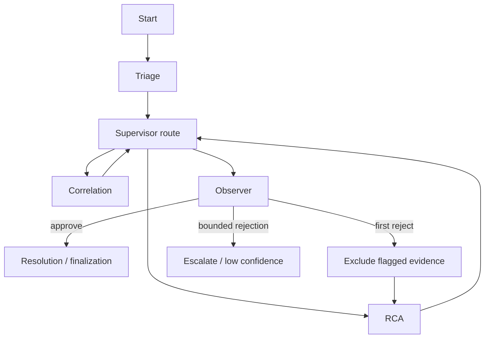

# LangGraph guide

LangGraph is Aegis’s orchestration layer. It turns a set of specialized agent functions into a controlled investigation rather than a collection of agents that call each other freely.

## Why use a graph

Incident response is iterative: a hypothesis may need more evidence, and a validator may reject an unsupported claim. A graph makes those branches explicit. It also gives one place to enforce recursion and revision bounds, persist each stage, and decide when an incident should stop automatically.

## Investigation state

The graph state carries the incident id, service/title/severity/alert facts, an opaque evidence store, correlation summary, retrieved runbook context, RCA result, Observer verdict, revision count, token accounting, completed steps, requested next step, and final state. The graph does not use this in-memory structure as the durable source of truth; meaningful results are persisted at node side-effect points.

| State item | Why it exists |
| --- | --- |
| `evidence_store` | Keeps redacted, structured evidence available to Correlation/RCA/Observer during a run. |
| `tokens_used` | Lets RCA and routing honor an incident-level budget. |
| `completed_steps` | Lets supervisor routing reason about what has already occurred. |
| `revision_count` | Stops repeated Observer rejection/RCA cycles. |
| `observer_verdict` | Is cleared when RCA changes, so the supervisor cannot route using a verdict for an older hypothesis. |

## Node lifecycle

Graph nodes delegate actual reasoning to agent modules. The graph itself is responsible for: calling a node; persisting its result/message/citations; emitting an SSE event; moving the incident lifecycle where appropriate; and carrying only needed output to later nodes.

## Supervisor routing and bounds

The supervisor selects available next steps from a constrained set rather than receiving an open-ended tool to invoke anything. It is additionally bounded by:

| Setting | Default | Protection |
| --- | ---: | --- |
| `CORRELATION_MAX_ROUNDS` | 3 | Limits plan → dispatch → observe cycles inside one Correlation invocation. |
| `CORRELATION_MAX_CALLS_PER_ROUND` | 4 | Limits evidence tool calls per planning round. |
| `CORRELATION_MAX_INVOCATIONS` | 2 | Limits supervisor returns to Correlation. |
| `SUPERVISOR_MAX_REVISIONS` | 1 | Allows only one hypothesis revision after validation failure. |
| `GRAPH_RECURSION_LIMIT` | 25 | Independent hard stop for graph traversal. |
| `INCIDENT_TOKEN_BUDGET` | 200000 | Prevents the incident’s model usage from growing without bound. |

These checks are implemented in code, not merely described in prompts. A malicious log line cannot ask the model to override a Python-enforced bound.

## Observer revision path

Observer first runs deterministic validation. If claims have unsupported citations, missing evidence, or injection-flagged evidence, the result is rejected. When the graph revises once, it removes flagged evidence before sending RCA back through the analysis path. A second rejection is not another invitation to spend tokens forever; it finalizes as a constrained low-confidence/escalation outcome.

## Explaining a graph step

When `EXPLANATIONS_ENABLED` is true, graph nodes can make a separate constrained explanatory call after the substantive work. The explanation describes inputs, evidence, tools, alternatives, uncertainty, and recommended next actions. This is an operator-reading aid: failures in explanation generation do not stop investigation and turning it off does not alter the underlying decision logic.

Related: [AI system](./ai-system.mdx) · [Backend guide](./backend.mdx) · [Evaluation](./evaluation.mdx).
