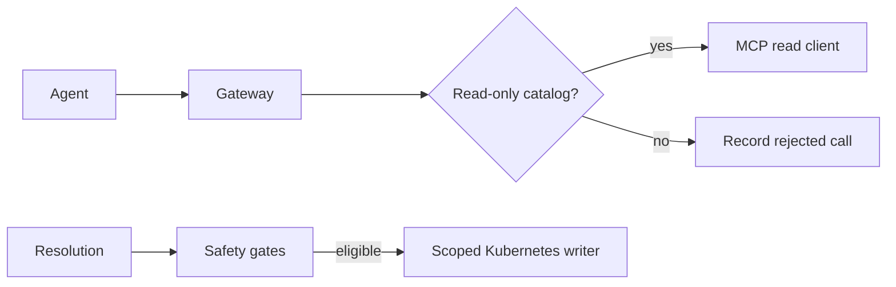

# MCP integrations

MCP (Model Context Protocol) is the capability boundary between Aegis agents and external systems. Agents request allowed tools through the gateway; they do not receive raw Kubernetes, Prometheus, GitHub, or Slack credentials.

## Read-only investigation catalog

Correlation can select only the entries in its explicit read-only catalog.

| Server | Tool | Investigation question |
| --- | --- | --- |
| Kubernetes | `list_pods` | Which pods exist, are ready, or are restarting? |
| Kubernetes | `get_pod` | Why is this known pod unhealthy? |
| Kubernetes | `get_pod_logs` | What does the application report for this known pod? |
| Kubernetes | `list_events` | What did the cluster report: OOM, probe, scheduling, eviction? |
| Kubernetes | `list_deployments` | Are desired/ready replicas or image tags relevant? |
| Prometheus | `query_metrics` | What is a metric’s current value? |
| Prometheus | `query_range_metrics` | When and how did a metric change? |
| Prometheus | `list_alerts` | Is the failure isolated or wider than one service? |
| GitHub | `get_recent_commits` | What recent changes are candidates? |
| GitHub | `get_commit_diff` | Does one candidate change touch the suspect behavior? |

The model may propose a tool name and arguments, but `validate_call` checks tool membership, required arguments, and unexpected arguments before dispatch. Write-capable tools do not become investigation tools simply because an MCP server happens to expose them.

## Kubernetes permissions

The repository contains separate Kubernetes RBAC manifests:

- The read service account can get/list/watch pod, log, event, service/endpoint, deployment, and replicaset information in scope.
- The writer service account is separately scoped to deleting pods and getting/patching/updating deployment scale.

The remediation catalog maps `restart_pod` and `scale_deployment` to the writer capability. `rollback_deploy` has no machine MCP tool and cannot be executed by Aegis.

## Error handling and caching

MCP calls use configured retry attempts, exponential base delay, and HTTP timeout. A tool result has an explicit `ok` flag, source/tool identifiers, typed error kind/message, untrusted-text marker, result data, and attempt count. A failure becomes an evidence gap after sanitization; it is not silently converted into “no findings.”

Evidence-source cache entries use Redis with a short TTL. A cache outage is tolerated; the tool can run directly. Cached output is not a database source of truth and must not be confused with an unchanged live cluster.

## External data is untrusted

Pod logs, GitHub commit messages/diffs, upstream API errors, and even error bodies can contain instructions or secrets. The evidence path redacts sensitive patterns and treats text as delimited data when inserted into prompts. Gap strings receive the same treatment: newlines are collapsed, prompt-like tags are defanged, and length is capped.

## Adding an integration

To add an evidence source safely, create a typed client/server result, establish narrowly scoped credentials, add only explicit read tools to the catalog, define validation, route outputs through redaction/evidence storage, add a contract fixture, and add fault-injection coverage. Do not expose a broad client method directly to a planner prompt.

Related: [AI system](./ai-system.mdx#evidence-discipline) · [Security and safety](./security-and-safety.mdx#evidence-and-external-access) · [Contributing](./contributing.mdx).
