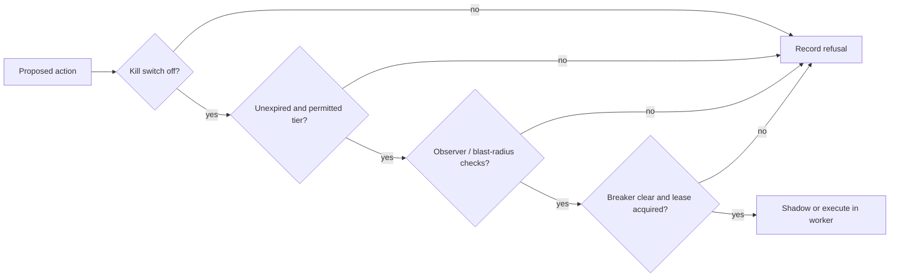

# Security and safety

Safety in Aegis is layered. It does not rely on a model deciding to be careful: identity, access control, tool capabilities, proposal state, and execution gates each independently constrain behavior.

## Authentication and roles

Google OAuth is performed by Firebase Authentication in the browser. The frontend uses Firebase **in-memory** persistence, exchanges an ID token only once at `POST /auth/session`, and signs Firebase out after the exchange. The backend verifies the Firebase token, provisions/updates the user, and issues Aegis access/refresh cookies configured as httpOnly.

Roles are assigned fail-closed from comma-separated email allowlists:

| Role | Authority |
| --- | --- |
| `viewer` | Authenticated read access, approval queue visibility, breaker/kill-switch status. Default for authenticated identities not in allowlists. |
| `on_call_engineer` | Resolve incidents, approve/reject Tier-2 proposals, approve memory, engage kill switch. |
| `admin` | All on-call authority plus disengage kill switch and clear the global circuit breaker. |

Refresh tokens are hashed in the database, rotated by family, and a reused rotated token revokes its entire family. Browser role gating is only a UX aid; all privileged API routes enforce roles server-side.

## Remediation tiers and gates

| Catalog action | Tier | Execution behavior |
| --- | --- | --- |
| `restart_pod` | 1 | May be auto-executed only after all gates; default configuration makes it a shadow action. |
| `scale_deployment` | 2 | Requires a human approval before worker execution. |
| `rollback_deploy` | 3 | Aegis may propose it but never executes it. |

Every proposal contains a compensating action. Before execution, the engine checks in this order: kill switch, proposal expiry, tier/approval status, Tier-1 Observer validation and blast-radius limit, global circuit breaker, and a database-backed resource lease. Any refusal is recorded and no action executes. Tier-1 actions are counted in time windows; a tripped global breaker requires admin clearance.

> [!WARNING]
> “Approved” is not the same as “executed.” A Tier-2 approval records a human decision; the worker still evaluates gates before an execution attempt.

## Evidence and external access

Agents do not receive infrastructure credentials. The MCP layer holds scoped credentials. The default investigation catalog is read-only; distinct Kubernetes writer RBAC exists for the explicit remediation tools. MCP calls have retries, bounded HTTP timeouts, typed error results, and caching where applicable.

Logs, API responses, diffs, and gap reasons are untrusted. Redaction runs before durable evidence/prompt handling; evidence is wrapped as data in prompts and suspicious injection material can be flagged and removed on an RCA revision.

## Operational security notes

- Never commit `.env`, Firebase service-account JSON, Kubernetes token/CA files, or model keys.
- `INGEST_WEBHOOK_TOKEN` is optional in local configuration; leaving it unset makes ingestion open and is not suitable for an exposed endpoint.
- CORS origins are configured by `CORS_ORIGINS` and frontend requests include cookies.
- LangSmith is optional. When enabled, traces use the already-redacted evidence path; telemetry failure must not interrupt investigation.

See [Using Aegis](./using-aegis.mdx#approve-or-reject-a-proposal) for the operator workflow and [Configuration](./configuration.mdx) for safety thresholds.
