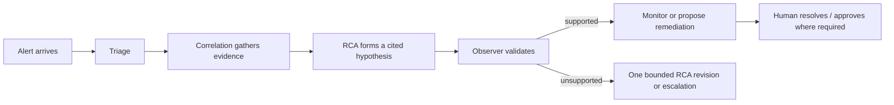

# Use Aegis during an incident

This guide is for the person responding to an incident. It explains what to look at, what Aegis does automatically, and where a human decision is required.

> [!IMPORTANT]
> Aegis investigates and can propose limited remediations. You remain responsible for operational decisions. Do not approve an action solely because it has a high model confidence score.

## What happens during an incident



1. An alert creates—or finds—the incident identified by its source and external alert id.
2. The worker investigates it asynchronously. The dashboard receives a live stream of persisted updates.
3. Triage assigns a severity assessment. Correlation gathers only allowlisted evidence from Kubernetes, Prometheus, and GitHub.
4. RCA combines the evidence with relevant runbook sections and approved past-incident memory.
5. Observer checks whether claims are supported. It can send the analysis back once or leave it low-confidence/escalated.

## Investigate an incident

### 1. Open the incident detail

Open the Dashboard and select the incident. Begin with the title, service, severity, and state; then read the timeline in order. The same information is available through `GET /api/v1/incidents/{id}`.

### 2. Separate observations from conclusions

Treat these as different things:

| Dashboard information | How to use it |
| --- | --- |
| Correlation evidence and gaps | Establish what was successfully observed and what is missing. |
| RCA hypothesis, confidence, agreement | A reasoned conclusion; confidence is not proof. |
| Citations | Inspect the concrete logs/metrics/diffs that support a claim. |
| Observer verdict | Tells you whether the system’s evidence checks approved the hypothesis. |
| Explanation | A readable account of inputs, tools, alternatives, uncertainty, and next steps. |

### 3. Work from the evidence

For example, a crash-loop investigation should lead you to pod state/termination reasons, relevant events and logs, and service metrics. If RCA attributes the issue to a deploy, look for the GitHub change evidence cited in the timeline. If a source failed, treat the recorded gap as a reason to investigate manually rather than evidence of absence.

> [!TIP]
> Use replay for a resolved incident when learning from it. Replay is built from persisted records, so it does not call a live cluster or recreate old conditions.

## Approve or reject a proposal

Open Approvals to view unexpired Tier-2+ proposals. Before deciding, review:

1. the action type and target resource;
2. the Resolution reasoning and alternatives rejected;
3. the stated blast radius and compensating action;
4. the RCA/Observer evidence trail; and
5. whether the proposal is still appropriate for the current incident state.

| Tier | What you can expect |
| --- | --- |
| 1 | `restart_pod`; only eligible after safety gates and shadowed by default. |
| 2 | `scale_deployment`; needs an on-call engineer or admin decision. |
| 3 | `rollback_deploy`; may be proposed, but Aegis never runs it. Use the normal human deployment process. |

Rejecting a proposal does not cause Aegis to retry it automatically. This prevents a rejected action from reappearing as if the human decision had not happened.

## Use the safety controls

- **Kill switch:** Any authenticated user can see its state. An on-call engineer or admin can engage it; only an admin can disengage it. Engaging it stops autonomous action, not investigation or read access.
- **Circuit breaker:** Limits mass Tier-1 action. Anyone authenticated can inspect it; only an admin can clear it.

See [Security and safety](./security-and-safety.mdx) for the complete gate order.

## Resolve and preserve the lesson

When the incident is resolved, an on-call engineer or admin can resolve it in the dashboard/API. Aegis then creates a draft memory summary from the final RCA outcome. Review it in the pending memory queue and approve it only after correcting the symptom, cause, fix, and outcome as needed. Approved memory can help later incidents; drafts cannot.

## If Aegis cannot reach a conclusion

An `escalated` state or rejected Observer verdict is useful information: it tells you the system’s bounded automated path has ended. Continue with the recorded evidence, gaps, and runbook search rather than assuming a missing conclusion means the incident is harmless. See [Operations](./operations.mdx#escalation-checklist).

## Read the incident states

| State | Meaning for an operator |
| --- | --- |
| `open` | The alert was stored but has not yet been claimed for investigation. |
| `investigating` | A worker owns the investigation. Watch its timeline; do not infer success from this state alone. |
| `hypothesis_formed` | The graph has produced an RCA outcome. Check the Observer verdict and citations. |
| `remediation_proposed` | An approval-required proposal is waiting for a human decision. |
| `remediation_approved` | A human approved a Tier-2 action; the worker still needs to pass execution gates. |
| `remediation_executed` | The remediation engine recorded an execution result. Continue monitoring the customer impact. |
| `monitoring` | The system is in the post-hypothesis observation portion of the lifecycle. |
| `resolved` | A human resolved the incident; a draft memory summary may be waiting. |
| `escalated` | Automation stopped because it could not safely reach a supported outcome. |
| `closed` / `reopened` | Lifecycle closure and later re-entry states available in the state machine. |

## A careful approval example

Suppose Aegis proposes `scale_deployment` for `payment-service` after an observed saturation pattern. The proposal is Tier 2. Before clicking approve, confirm that the target is exactly the expected Meridian deployment, the cited metrics show the condition still exists, the stated previous replica count is available for the compensating scale-back, and the dependent blast-radius description makes sense. If any of those facts are stale or unclear, reject the proposal and use the normal operating process instead.

The API reflects the same workflow:

```json
{
  "action_id": "<remediation-action-uuid>",
  "decision": "approved",
  "notes": "Metrics and current deployment state reviewed by on-call."
}
```

The request is sent to `POST /api/v1/actions/incidents/{incident_id}/approvals`. It is an approval record, not an instruction for the API server to modify Kubernetes synchronously.
